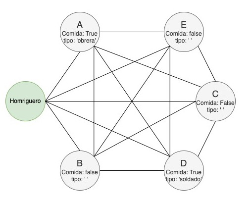

## Propuesta de Estructura de Datos

Para la elección de la Estructura de Datos a manejar, se considera el procedimiento de las hormigas para hallar alimento. Este procedimiento inicia con la exploración del territorio y 
la búsqueda de comida que pueda existir en dicho territorio, tomando en cuenta que las hormigas desprenden cierto tipo de feromonas, que para esta acción se enfatizará en las feromonas 
de inicio de exploración y búsqueda de alimento.

Para definir esta problemática, se considera:

- Un grafo no dirigido de par G=(V,E).

- El conjunto de vértices V = {0,1,…,n}, contempla desde el 0 hasta el n-ésimo valor, donde el 0 representa el hormiguero, es decir, tanto el punto de inicio como el punto final de la
- exploración. El resto de los vértices representan el territorio de exploración.

- A cada nodo i∈V – {0} , se le asocia la existencia de comida c_i (cuyo valor 	puede ser true o false); en caso de ser un valor true, se define el tipo de alimento (de obrera, de soldado,
- de príncipes, de nodriza).

- El conjunto de aristas E, en donde una arista (i,j)∈E , para efectos prácticos, será c_ij=1 .

- Una cantidad limitada de hormigas de clase obrera con una capacidad de carga Q>0 .

Esta definición de conjuntos está basada en la solución propuesta en el trabajo de tesis titulado ‘Desarrollo de propuesta heurística para el Split Delivery Vehicle Routing Problem’ de mi propia autoría. 

La teoría que se propone consiste de una cantidad de nodos finitos repartidos en un mapa en 2D, con sus respectivas coordenadas, iniciar una exploración del territorio recorriendo nodos adyacentes al 
nodo en que se encuentra la hormiga, hasta encontrar un nodo que contenga alimento. Cada hormiga posee una capacidad máxima de carga para llevar comida hacia el hormiguero , ya que en caso de que la 
cantidad de comida supere la capacidad de esta, deberá realizar más de un viaje de ida y vuelta, si se considera que cada hormiga es responsable de trasladar el alimento encontrado hacia la colonia. 
En caso de que una segunda hormiga logre llegar al mismo nodo en donde la primera encontró comida, la ruta de vuelta hacia la colonia será la ruta de la hormiga que menor coste posea desde el nodo con 
alimento hasta el hormiguero (nodo inicial/final).

La información sobre la comida hallada, será almacenada en un diccionario compuesto de clave y valor ( dict { clave : valor } ), donde la clave represente el tipo de comida hallada y el valor, 
la cantidad de esta.

El diagrama visualiza la disposición de nodos dentro de un grafo no dirigido y todas sus posibles aristas, donde su conjunto de vértices está definido como  V = {A,B,C,D,E}. Por su parte, el conjunto de 
aristas se compone de todos las posibles combinaciones entre nodos, se toma como ejemplo la combinación de caminos que presenta el nodo B, que son las aristas  (B,A), (B,D), (B,E) y (B,C).
